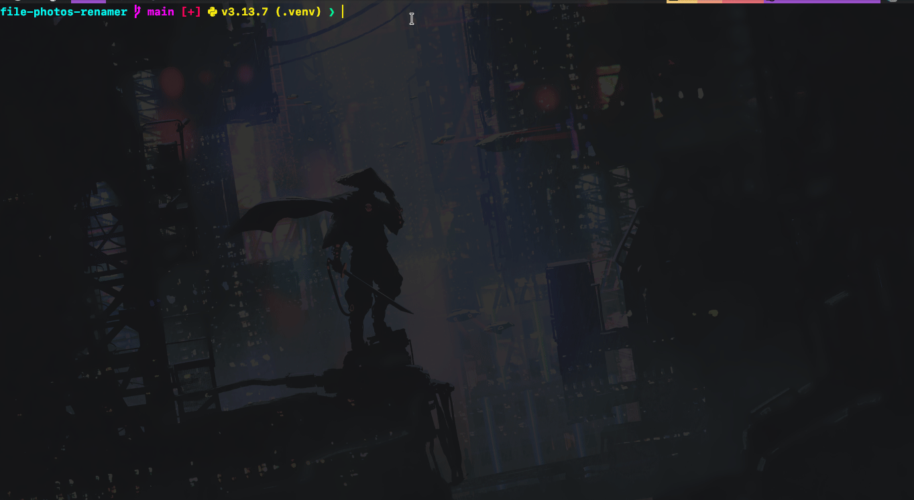

# 📂 Media Renamer

[🇪🇸 Leer en Español](./README.es.md)


A simple and intuitive **CLI tool** to bulk rename photos and videos with
sequential numbers or custom prefixes. It supports a variety of file formats
(JPEG, PNG, MP4, MOV, etc), includes a dry-run mode for safe previews, and
shows progress with a clean, colorful terminal interface.

---

## 🎥 Demo



---

## ✨ Features

- Bulk renaming for photos **and** videos
- Customizable prefix (`vacation_001.jpg`)
- Dry-run mode (preview without renaming)
- Progress bar and colorful console output
- Supports common image and video formats

---

## 🚀 Installation

1. Clone the repository:

   ```bash
     git clone git@github.com:blandoncj/media-renamer.git
     cd media-renamer
   ```

2. Create a virtual environment and activate it:

   ```bash
     python -m venv .venv
     source venv/bin/activate  # On Windows use `.venv\Scripts\activate`
   ```

3. Install dependencies:

   ```bash
     pip install -r requirements.txt
   ```

---

## ▶️ Usage

Run the tool directly from the terminal:

- **Dry run (preview changes without renaming):**

  ```bash
    python main.py /path/to/your/media --dry-run
  ```

- **Rename with a prefix:**

  ```bash
    python main.py /path/to/your/media --prefix vacation
  ```

- **Rename without a prefix:**

  ```bash
    python main.py /path/to/your/media
  ```

Example result:

```bash
  📂 Processing 5 files in 'media'
  ✔ IMG_1234.JPG → vacation_001.jpg
  ✔ IMG_5678.PNG → vacation_002.png
  ✔ video1.MP4   → vacation_003.mp4

```

---

## 🛠️ Tech Stack

- Python 3.8+
- [Typer](https://typer.tiangolo.com/) for CLI argument parsing
- [Rich](https://rich.readthedocs.io/en/stable/) for beautiful terminal output
- [Tqdm](https://github.com/tqdm/tqdm) for progress bars

---

## 📜 License

This project is licensed under the MIT License. See the [LICENSE](LICENSE)
file for details.

---

## 💡 Contributing

Contributions, issues, and feature requests are welcome!
Feel free to open a **PR** or contact me.

---

Made with ❤️ by [blandoncj](https://github.com/blandoncj)
